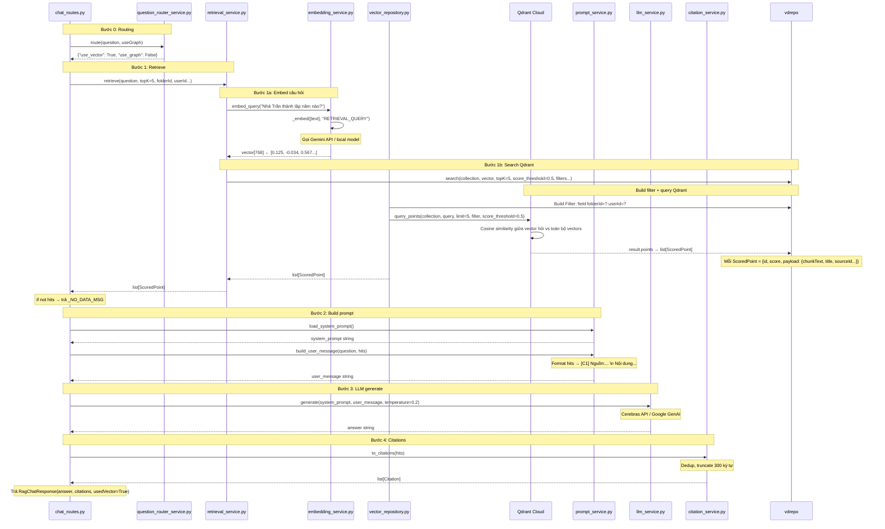

# Retrieval Flow — File-to-File Sequence

## File Mapping

| Bước | File                                                  | Vai trò                                |
| ---- | ----------------------------------------------------- | -------------------------------------- |
| 0    | `rag-service/app/api/chat_routes.py`                  | Nhận request, điều phối pipeline       |
| 0    | `rag-service/app/services/question_router_service.py` | Quyết định dùng vector/graph           |
| 1    | `rag-service/app/services/retrieval_service.py`       | Embed + Search Qdrant                  |
| 1a   | `rag-service/app/services/embedding_service.py`       | Embed câu hỏi → vector 768             |
| 1b   | `rag-service/app/vectorstore/vector_repository.py`    | Build filter + query_points() → Qdrant |
| 2    | `rag-service/app/services/prompt_service.py`          | Format hits → [C1]...[Cn] context      |
| 3    | `rag-service/app/services/llm_service.py`             | Cerebras/Google generate answer        |
| 4    | `rag-service/app/services/citation_service.py`        | Map ScoredPoint → Citation             |
